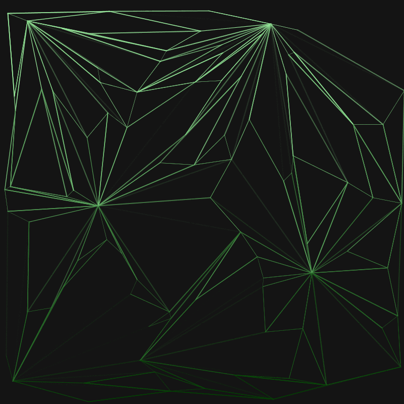
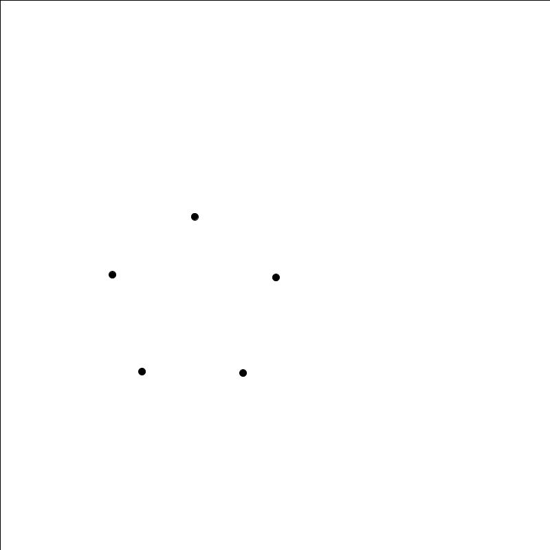
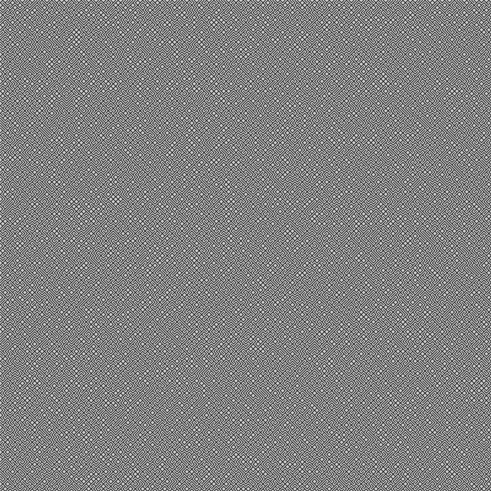
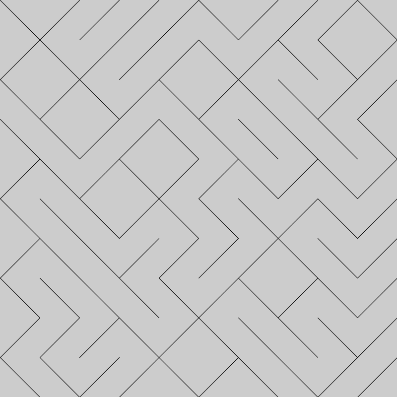
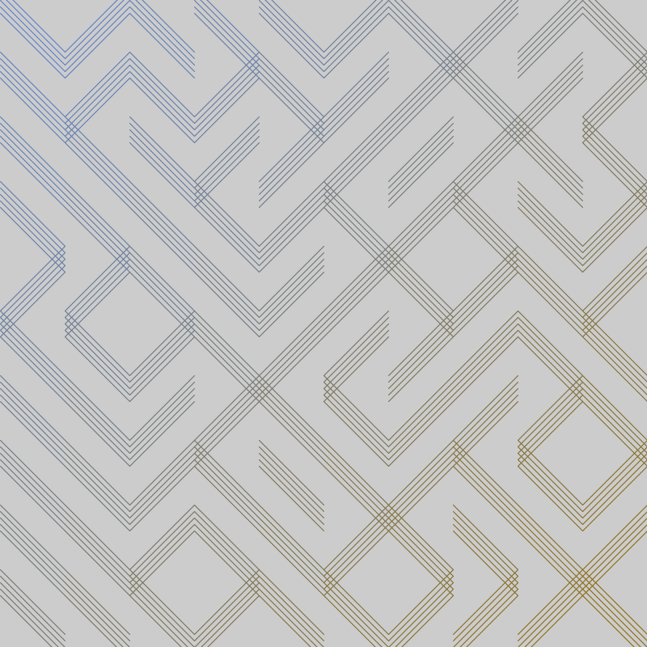

Cellular Automata

Let Cellular Automata Play with 2 set of rules.
You can place cellule where you want with left click and stop time with .

Generate In Text

Make random square fit with a text.

Lines Effect

Line connect by distance. 2 possibles ways :

or like this :

Planets

Make planets with points. Planets can have moon and asteroids belt.

Worms

An army of worms who move randomly in space.

Harminc In Circle

Few points who turn in differents circle.

Simple Grid

A grid whit gradient color or not.

